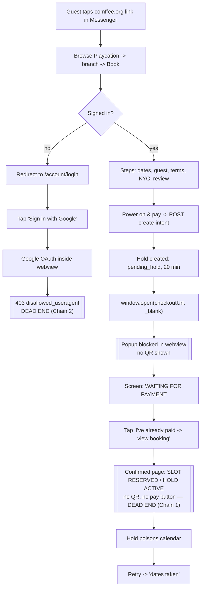
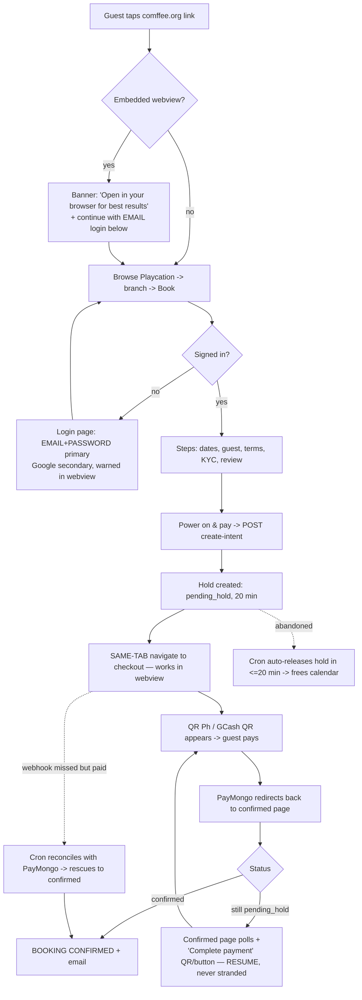

# Comffee Playcation — Booking Flow (bulletproof)

> Owner-facing map of the guest booking + payment + auth flow, the two broken
> chains a real guest hit, and the fix that removes every dead end.
> Living doc — the "Ralph progress log" at the bottom tracks each fix.

## The incident (2026-06-25)

A guest arriving from a **Facebook Messenger link** reported: "the booking flow is
so confusing, no payment QR appeared," then on retry "the dates were taken."
Two screenshots:

1. **`SLOT RESERVED // TRANSMISSION COMPLETE — held for 20 minutes`** with a
   reservation id, but **no QR and no way to pay**.
2. **`Access blocked … Error 403: disallowed_useragent`** — Google OAuth refused
   inside Messenger's in-app browser.

### Root cause (one sentence)

The flow assumes a normal desktop-style browser, but guests arrive in
**Messenger's embedded webview**, where two things are blocked by the platform:

- **Google OAuth** → `disallowed_useragent` (Google bans OAuth in webviews). And
  the booking page is gated behind sign-in, so this is a hard wall, not a nuisance.
- **`window.open(url, "_blank")`** → popups are silently blocked, so the PayMongo
  checkout (which hosts the QR) never opens → the guest lands on the QR-less
  "SLOT RESERVED" receipt and is stranded. Their own 20-min hold then makes a
  retry say "dates taken."

Both chains have the **same** cause: the flow does not survive an embedded browser.

## The two broken chains (in code)

### Chain 1 — payment QR never appears
- `src/components/booking/BookingClient.tsx:251` — on success the client does
  `window.open(data.checkoutUrl, "_blank", "noopener")`. **Blocked in webviews.**
- `src/app/api/payments/create-intent/route.ts:227` — `createPaymentLink()` makes
  a PayMongo **hosted** checkout (`checkout_url`) that hosts the QR. The QR is
  off-site; reaching it depends on the blocked popup.
- `src/app/(site)/playcation/[slug]/confirmed/[reservationId]/page.tsx:98,184` —
  the hold receipt says "held for 20 minutes while payment processes" but renders
  **only** "My bookings / View branch / Browse" links. **No QR, no pay button, no
  resume.** Dead end.

### Chain 2 — OAuth dead end for Messenger arrivals
- `src/app/(site)/playcation/[slug]/book/page.tsx:89` — `requireMember()` redirects
  to `/account/login` before the form can render.
- `src/app/(site)/account/_actions/auth.ts:147` — `signInWithOAuth({provider:"google"})`.
  In a webview Google returns 403. **Email+password login exists** (`memberLoginAction`,
  same file) and works in webviews — the guest just tapped Google.
- No embedded-webview detection exists anywhere (no `FBAN`/`FBAV`/`Instagram`/`wv` check).

## What already works (do not rebuild)
- **20-min hold + auto-release:** `src/app/api/cron/release-expired-holds/route.ts`
  sweeps `pending_hold` past `hold_expires_at` every 5 min, **reconciles with
  PayMongo** (rescues paid-but-webhook-missed holds), cancels the rest → frees the
  calendar. So "dates taken" self-heals within ~5 min of the 20-min window.
- **Concurrency:** a GIST exclusion constraint on `reservations` blocks overlapping
  `pending_hold`/`confirmed` ranges at the DB level.
- **Inline QR is available:** `createQrPhIntent()` in `src/lib/paymongo.ts` returns a
  base64 QR image (used by game top-ups / PC reservations) — usable for an in-page QR.

## AS-IS flow (broken)

## TARGET flow (bulletproof — no dead ends)

## Reservation state machine (every state has a forward path)

| State | Enter when | Forward paths (no dead ends) |
|---|---|---|
| `pending_hold` | hold created at create-intent (`hold_expires_at = now + 20m`) | **pay** → `confirmed`; **expire unpaid** → `cancelled` (cron frees calendar); **expire but paid** → `confirmed` (cron reconciles). While in this state the guest is **always** shown the QR / a resume-payment button. |
| `confirmed` | payment confirmed (webhook, redirect-poll, or cron rescue); Playcation instant-confirms | partial w/ balance → balance due flow; else terminal-until-stay → `completed` |
| `cancelled` | hold expired unpaid, or balance unpaid by due date | terminal; calendar freed; guest can rebook |
| `completed` | after stay (out of scope here) | terminal |

**Invariant:** a `pending_hold` can never strand a guest — it either becomes
payable (QR/resume always visible) or auto-releases. The calendar can never be
permanently poisoned by an unpaid hold.

## Fix checklist — DONE

- [x] **FIX 1 — QR appears (Chain 1, top priority):** `BookingClient.handleSubmit`
      now does `window.location.href = checkoutUrl` (same-tab) instead of
      `window.open(_blank)`. The PayMongo hosted page (which renders the QR Ph code)
      opens reliably in webviews; PayMongo redirects back to the confirmed page.
      _(commit 3d3f064)_
- [x] **FIX 2 — never-stranded hold:** the confirmed page, while `pending_hold`,
      fetches the hosted `checkout_url` via `getPaymentLink()` and renders a
      **"Complete payment"** CTA, plus `ReservationStatusPoller` auto-advances the
      page when payment lands. Best-effort fallback to the account link if PayMongo
      is unreachable — no dead end. _(commit 3d3f064)_
- [x] **FIX 3 + 4 — in-app browser steering (Chain 2):** provided by the **existing
      `main` implementation** — `lib/in-app-browser.ts` (SSR-aware detector, named
      browsers) + the `WebviewNotice` banner on the auth pages (login / signup),
      which steers Messenger arrivals to the email+password path that works inside a
      webview. This branch KEEPS that work rather than shipping a second, competing
      detector/banner. _(main commits 1bf3f7a–2d9f725)_
- [x] **FIX 5 — friendly "dates taken":** `create-intent` now detects when the
      blocking hold is the **member's own** active `pending_hold` and returns
      `resumeReservationId`; the client routes them to that booking to finish paying
      instead of a dead "dates taken." _(commit 3d3f064)_

## Integration note (branch `deploy/booking-webview-complete`)

A parallel effort on `main` (commits 1bf3f7a–2d9f725) had already fixed **Chain 2**
(webview detector + `WebviewNotice` banner on auth pages) but left **Chain 1**
untouched — `BookingClient` still did `window.open(_blank)`, so the payment QR still
never appeared in a webview. This branch is the reconciliation: it keeps main's
Chain-2 work and adds **only** the Chain-1 fixes it was missing (same-tab checkout,
confirmed-page resume CTA + poller, same-member-hold resume). The duplicate
detector/banner from the first cut of this fix were dropped in favour of main's.

## Verification (the way a guest hits it)

- **Chain 2 (main's work):** the webview banner shows on `/account/login` for a
  Messenger user-agent and not for a real browser — re-confirmed on this integration
  branch with Playwright before deploy, and again on production after deploy.
- **Chain 1 (this branch):** `/playcation/[slug]/book` and the confirmed page compile
  and render; the same-tab redirect + resume CTA are guarded, additive changes on the
  proven PayMongo payment-link path. A full click-through (webview → PayMongo → QR →
  paid) needs a live held booking against **production** Supabase, deliberately NOT
  created; the same-tab redirect is a universal browser primitive, so the QR page now
  opens where the blocked popup did not.
- **Suite:** 165 unit tests pass; typecheck clean; production build green. One suite
  (`webhooks/paymongo`) fails to import in the vitest env (`server-only`) —
  pre-existing, identical on baseline, unrelated.

## Ralph progress log

### Iteration 1 — diagnosis + plan (2026-06-25)
- Mapped the full booking/payment/auth flow in code (BookingClient, create-intent,
  confirmed page, auth actions, release-expired-holds cron, payments/status).
- Root cause confirmed: embedded webview blocks both Google OAuth and
  `window.open(_blank)` → both reported failures.
- Created branch `fix/booking-flow-qr-inapp-browser` off `main` (NOT pushing to
  main; main auto-deploys to Vercel — deploy is gated).
- Wrote this doc: AS-IS + TARGET flowcharts, state machine, fix checklist.

### Iteration 2 — implement the fixes (2026-06-25)
- Read the payment internals (paymongo.ts, reservations.ts) to choose the
  lowest-risk approach: keep the proven PayMongo payment-link path, fix only the
  blocked-popup delivery. Rejected rewriting Playcation to inline `createQrPhIntent`
  (would risk breaking confirmation on a live payment path for marginal gain).
- Implemented FIX 1–5 (see checklist). New components: `InAppBrowserBanner`,
  `ReservationStatusPoller`. Commit 3d3f064.

### Iteration 3 — verify in the real surface + harden (2026-06-25)
- Extracted detection to `lib/in-app-browser.ts` + 11 unit tests.
- Playwright verification on the live dev server: Messenger UA → banner shown;
  Safari UA → not shown. Fixed a grammar bug in the banner copy caught only by
  looking at the rendered page.
- Removed the now-dead popup "paying" step from `BookingClient`. Commit ab1ab05.

### Iteration 4 — close out (2026-06-25)
- Marked checklist done, recorded verification + commit refs in this doc.
- Branch `fix/booking-flow-qr-inapp-browser` is ready for review/PR. NOT pushed to
  `main` (main auto-deploys to Vercel; customer-facing deploy stays gated).
